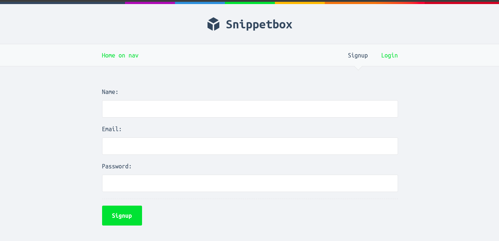
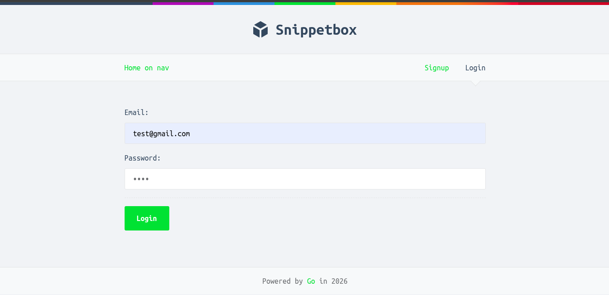
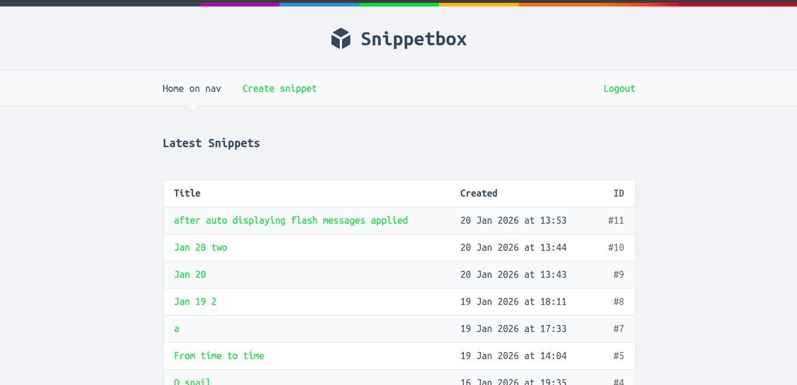
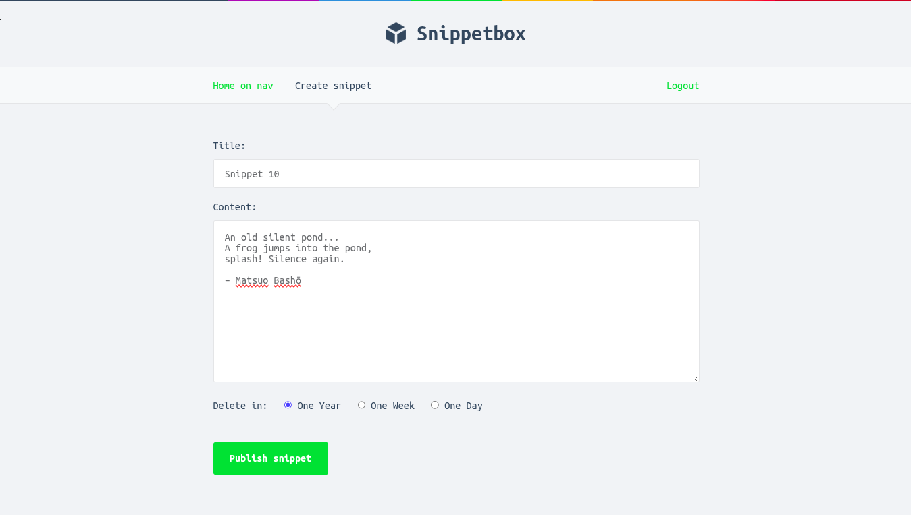
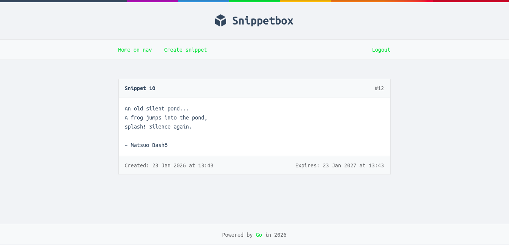

# Snippetbox

Snippetbox is a production-style web application built in **Go** as part of a deeper study of professional backend engineering practices, and it represents a complete implementation of the Let’s Go book project. This project was intentionally extended and treated as a **real-world backend system**, focusing on clean architecture, testability, and production concerns rather than a tutorial-only outcome.

The goal of this project is to publicly demonstrate my **Go backend skills**, including HTTP server design, database interactions, authentication, testing with mocks, and deployment-oriented structure — especially since my main commercial projects (gaming platforms and ERP systems) are private repositories.

---

## Project Overview

Snippetbox allows users to create, view, and manage text snippets through a web interface. It includes:

* User authentication and session management
* Secure creation and retrieval of snippets
* Server-side rendered HTML templates
* Persistent storage using a relational database
* Comprehensive automated tests
  
---

## Architecture & Design

The application follows a **clear separation of concerns**:

* **cmd/web** – Application entry point, HTTP server setup, routes, middleware
* **internal/handlers** – Request handlers and application logic
* **internal/models** – Database models and interfaces
* **internal/mocks** – Mock implementations used for testing
* **ui/** – HTML templates and static assets

Key design principles applied:

* Dependency injection via interfaces
* Explicit error handling and logging
* Test-first thinking for critical components
* Minimal global state
* Idiomatic Go project layout

---

## Testing Strategy

Testing is a first-class concern in this project.

* Database access is abstracted behind interfaces
* Mock implementations are used to test handlers without a real database
* HTTP handlers are tested using Go’s `net/http/httptest`
* Tests validate routing, status codes, responses, and edge cases

This approach mirrors how backend services are tested in production systems where isolation and reliability matter.

---

## Database

* Relational database MySQL, (PostgreSQL compatible)
* Structured schema with proper indexing
* Context-aware queries
* Defensive handling of SQL errors

---

## Security

* Password hashing using bcrypt
* Secure session management
* CSRF protection
* Proper HTTP headers
* Input validation and error sanitization

---

## Tech Stack

* **Language:** Go
* **HTTP:** net/http
* **Templates:** Go HTML templates
* **Database:** MySQL
* **Testing:** testing, httptest, mocks
* **Auth:** bcrypt, secure cookies

---

## Screenshots

> Screenshots of the Snippetbox UI are included to demonstrate the working application and user flow.

* User signup & login

* Home page with recent snippets

* Snippet creation form

* Snippet detail view

For an interactive experience, see the live demo: [snippetbox.high-la.dev](https://snippetbox.high-la.dev)

---

##  Author

**Haile Berhaneselassie**
Backend Engineer (Go)
🌐 [https://high-la.dev](https://high-la.dev)

---

## 📄 Notes for Reviewers

This repository is intended to be reviewed as a backend engineering sample:

* Focus on project structure, test strategy, and clarity
* Code favors correctness, readability, and maintainability over shortcuts
* Patterns used here are the same ones I apply in larger production systems

Thank you for taking the time to review this project.
